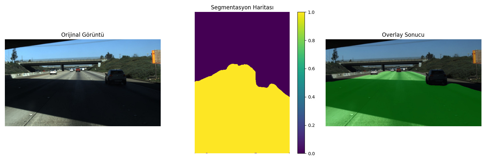

# Road Segmentation with Improved U-Net

This project is designed for road segmentation using an improved U-Net architecture. The model detects roads in images and generates segmentation maps.

## 🎯 Demo Results

<div align="center">
  
  <br>
  <em>Road segmentation results: Original image (left), Segmentation mask (center), Overlay result (right)</em>
</div>


*Real-time road segmentation demonstration*

## 🚀 Features

- **Improved U-Net Architecture**: Enhanced standard U-Net model for better performance
- **Image Inference**: Road segmentation on single images
- **Video Inference**: Real-time road segmentation in video files
- **Visualization**: Interactive visualization of segmentation results
- **Model Saving**: Automatic saving of the best model
- **Flexible Dataset**: Easy training with custom dataset structure

## 📁 Project Structure

```
RoadSegmentation/
├── checkpoints/              # Trained model files
├── data/                     # Dataset
│   ├── train_images/         # Training images
│   ├── train_masks/          # Training masks
│   ├── val_images/           # Validation images
│   └── val_masks/            # Validation masks
├── challanges_image/         # Test images
├── challanges_video/         # Test videos
├── plots/                    # Training plots
├── saved_images/             # Saved results
├── training.py               # Model training
├── improved_unet.py          # Improved U-Net model
├── image_inference.py        # Image inference
├── video_inference.py        # Video inference
├── dataset.py                # Dataset class
├── loss.py                   # Loss functions
├── utils.py                  # Utility functions
├── check_masks.py            # Mask checking tools
├── README.md                 # README file
└── requirements.txt          # Required libraries
```

## ⚙️ System Requirements

### Minimum Requirements
- **Python**: 3.10+
- **RAM**: 8GB (for GPU usage)
- **GPU**: CUDA-compatible GPU (recommended)
- **Disk Space**: 2GB+ (for model and data)

### Recommended Requirements
- **Python**: 3.12.11 (highly recommended)
- **GPU**: 6GB+ VRAM
- **RAM**: 16GB+
- **CPU**: Multi-core processor
- **Training Time**: ~2-4 hours (100 epochs, depending on GPU)

## 🛠️ Installation

```bash
git clone https://github.com/enessehirli1/RoadSegmentation.git
cd RoadSegmentation
pip install -r requirements.txt
```

### Main Dependencies

- PyTorch
- torchvision
- OpenCV (cv2)
- NumPy
- Matplotlib
- PIL (Pillow)
- Scikit-learn
- Seaborn
- Albumentations

## 📊 Dataset Preparation

Organize your dataset in the following structure:

```
data/
├── train_images/     # Training images (.jpg, .png)
├── train_masks/      # Training masks (0: background, 1: road)
├── val_images/       # Validation images
└── val_masks/        # Validation masks
```

## 🚀 Usage

### 1. Model Training

```bash
python training.py
```
You can change the parameters in config class in training.py ! 
Training parameters:
- **Epochs**: Set by default
- **Batch Size**: Optimized for GPU capacity
- **Learning Rate**: Adaptive learning rate scheduler
- **Loss Function**: Combination of Dice Loss + Cross Entropy Loss

### 2. Image Inference

image_inference.py tests multiple images by default.

```bash
python image_inference.py
```

**Features:**
- Single or multiple image testing
- Segmentation map visualization
- Overlay images
- Statistical analysis (pixel percentages)
- Option to save results

**Image Testing Example:**
```python
# Edit code for single image testing
image_path = "challanges_image/test_image1.jpg"
model_path = "checkpoints/best_model.pth.tar"

overlay, segmentation_map, colored_mask = process_single_image(
    image_path=image_path,
    model_path=model_path,
    save_result=True,
    output_path="result.jpg"
)
```

### 3. Video Inference

```bash
python video_inference.py
```

**Features:**
- Real-time video segmentation
- Live visualization (matplotlib)
- Video saving option
- Frame-by-frame processing
- Progress tracking

**Video Testing Example:**
```python
video_path = "challanges_video/highway_test.mp4"
model_path = "checkpoints/last_best_model.pth.tar"
output_path = "output_segmentation.mp4"

process_video(video_path, model_path, output_path, show_live=True)
```

## 🏗️ Model Architecture

### Improved U-Net
- **Attention Blocks**: Selective feature attention in skip connections
- **ASPP Bottleneck**: Multi-scale context aggregation with dilated convolutions
- **Double Convolution Blocks**: Enhanced feature extraction with dropout regularization
- **Progressive Feature Refinement**: Gradual upsampling with feature fusion

### Model Specifications
- **Input Channels**: 3 (RGB)
- **Output Channels**: 2 (Background, Road)
- **Input Size**: 320x480 (HxW)
- **Feature Maps**: [64, 128, 256, 512]
- **Dropout Rate**: 0.2
- **Total Parameters**: 44.2M trainable parameters

## 📈 Training Process

### Loss Function
- **Combined Loss**: Dice Loss + Cross Entropy Loss
- **Loss Alpha**: 0.7 (Dice loss weight)
- **Alternative Loss Types**: Dice, Tversky, Focal Loss
- **Weighted Combination**: Segmentation quality optimization

### Optimization
- **Optimizer**: Adam
- **Learning Rate**: 1e-3 (initial)
- **Scheduler Types**: Plateau, Cosine, OneCycle
- **Early Stopping**: Overfitting prevention with patience of 20
- **Model Checkpointing**: Save best and last model
- **Torch Compile**: Performance optimization (optional)

### Metrics
- **Dice Score**: Main performance metric
- **IoU (Intersection over Union)**: Segmentation accuracy
- **Pixel Accuracy**: Pixel-level accuracy

## 🎯 Results

### Output Formats
1. **Segmentation Map**: Class predictions (0, 1)
2. **Colored Mask**: Colored segmentation mask
3. **Overlay**: Original image + mask overlay
4. **Statistics**: Class distribution percentages

### Color Coding
- **Black (0, 0, 0)**: Background
- **Green (0, 255, 0)**: Road

## 🔧 Customization

### Hyperparameter Settings
```python
# You can edit in the Config class
class Config:
    # Model parameters
    IN_CHANNELS = 3
    OUT_CHANNELS = 2
    FEATURES = [64, 128, 256, 512]
    DROPOUT_RATE = 0.2
    
    # Training parameters
    LEARNING_RATE = 1e-3
    BATCH_SIZE = 8
    NUM_EPOCHS = 100
    
    # Image dimensions
    IMAGE_HEIGHT = 320
    IMAGE_WIDTH = 480
    
    # Loss function
    LOSS_TYPE = "combined"  # "dice", "combined", "tversky", "focal"
    LOSS_ALPHA = 0.7        # Dice weight for combined loss
    
    # Early stopping
    EARLY_STOPPING_PATIENCE = 20
    MIN_DELTA = 1e-4
```

### Model Parameters
```python
# You can edit in improved_unet.py
model = ImprovedUNET(in_channels=3, out_channels=2)
```

## 📝 Tips

### Performance Optimization
- **GPU Usage**: Install CUDA (10x speedup)
- **Batch Size**: Adjust according to your GPU memory (8-16 range)
- **Torch Compile**: Enable for performance
- **Workers**: Adjust according to your CPU core count
- **Mixed Precision**: Use AMP for memory savings

### Troubleshooting
- **Python Version Compatibility**: Use recommended Python version (3.12.11)
- **CUDA out of memory**: Reduce batch size to 4
- **Model loading error**: Check checkpoint path
- **Video processing slow**: Use GPU instead of CPU
- **Torch compile error**: Set `USE_TORCH_COMPILE = False`
- **ImportError**: Run `pip install -r requirements.txt`

## 📄 License

This project is licensed under the MIT License.

---

